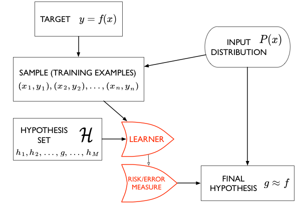
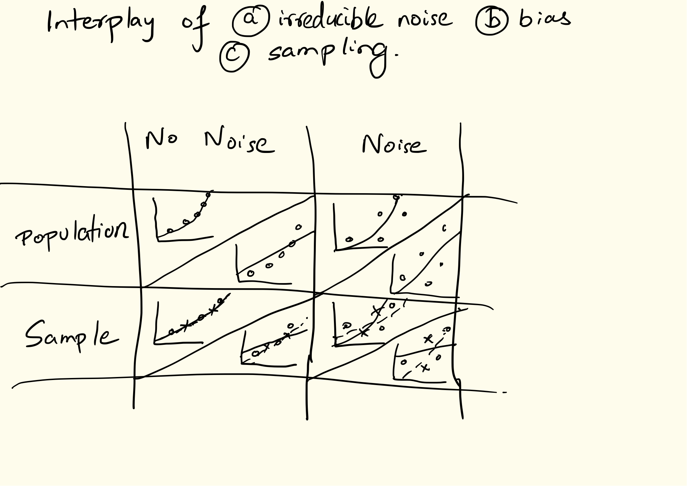
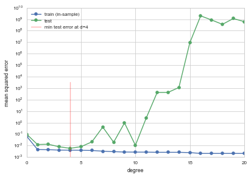
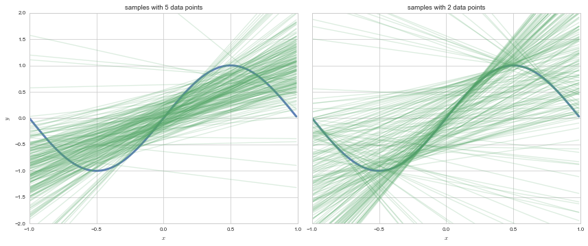
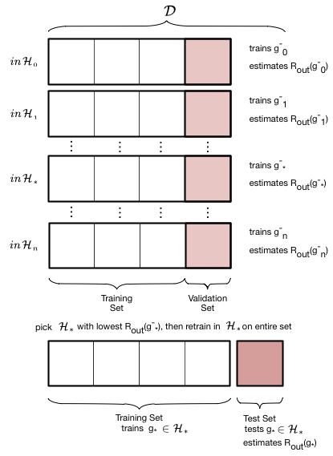
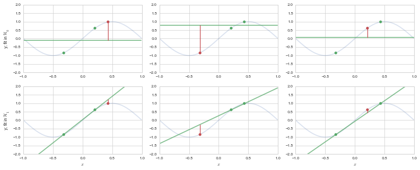

footer:
autoscale: true

---

#[fit] Ai 1

---

#[fit] Learning a Model

---

## Last Time

1. What is $$x$$, $$f$$, $$y$$, and that damned hat?
2. The simplest models and evaluating them
3. Frequentist Statistics
4. Noise and Sampling
5. Bootstrap
   
---

## Today

1. SMALL World vs BIG World
2. Approximation
3. THE REAL WORLD HAS NOISE
4. Complexity amongst Models
5. Validation and Cross Validation 

---

##[fit] 1. SMALL World 
## vs 
##[fit] BIG World

---

- *Small World* given a map or model of the world, how do we do things in this map? 
- *BIG World* compares maps or models. Asks: whats the best map? 

(Behaim Globe, 21 inches (51 cm) in diameter and was fashioned from a type of papier-mache and coated with gypsum. (wikipedia))

---

#[fit]RISK: What does it mean to FIT?

Minimize distance from the line?

$$R_{\cal{D}}(h_1(x)) = \frac{1}{N} \sum_{y_i \in \cal{D}} (y_i - h_1(x_i))^2 $$

Minimize squared distance from the line. Empirical Risk Minimization.

$$ g_1(x) = \arg\min_{h_1(x) \in \cal{H_1}} R_{\cal{D}}(h_1(x)).$$

##[fit]Get intercept $$w_0$$ and slope $$w_1$$.

---

#[fit] HYPOTHESIS SPACES

For example, a polynomial looks so:

 $$h(x) = \theta_0 + \theta_1 x^1 + \theta_2 x^2 + ... + \theta_n x^n = \sum_{i=0}^{n} \theta_i x^i$$

All polynomials of a degree or complexity $$d$$ constitute a hypothesis space.

$$ \cal{H}_1: h_1(x) = \theta_0 + \theta_1 x $$
$$ \cal{H}_{20}: h_{20}(x) = \sum_{i=0}^{20} \theta_i x^i$$

---

## Small World vs Big World, redux

*Small World* answers the question: given a model class (i.e. a Hypothesis space, whats the best model in it). Thus its looking for a particular $$h(x)$$ in a particular $${\cal H}$$.

*BIG World* compares model spaces. Wants to find the true f(x), or at least the **best** $$h(x)$$ in the best $${\cal H}$$ amongst the Hypothesis spaces we test.

Why not test ALL hypothesis spaces?

---

#[fit] 2. Approximation

## Learning Without Noise...

---

[^*]

[^*]: image based on amlbook.com

---

## Constructing a sample from a population

Well usually you are only given a sample. What is it?

Its a set of $$(x, y)$$ points chosen from the population.

If you had the population you could construct many samples of a smaller size by randomly choosing subsamples of such points.

If not you could bootstrap.

---

A sample of 30 points of data. Which fit is better? Line in $$\cal{H_1}$$ or curve in $$\cal{H_{20}}$$?

---

# Bias or Mis-specification Error

---

## Sources of $$\,$$Variability

- Even on a population, there is a $$p(x)$$. There are more young voters in India
- sampling: different samples can have varying $$p(x)$$, so we can denote this $$\hat{p}(x)$$
- noise comes from measurement error, missing features, etc..a combination of many small things...thus we have a $$p(y | x)$$ even on the population
- because only certain values of y may have been chosen for a given x bin by the sampling process, we have a $$\hat{p}(y | x)$$
- mis-specification: choice of hypothesis set create bias which adds to the noise

---

---

#[fit] 3. THE REAL WORLD 
#[fit] HAS NOISE

### (or finite samples, usually both)

---

---

#Statement of the Learning Problem

The sample must be representative of the population!

$$A : R_{\cal{D}}(g) \,\,smallest\,on\,\cal{H}$$
$$B : R_{out} (g) \approx R_{\cal{D}}(g)$$

A: In-sample risk is small
B: Population, or out-of-sample risk is WELL estimated by in-sample risk. Thus the out of sample risk is also small.

---

Which fit is better now?
                                              The line or the curve?

---

[^*]

---

## Training sets

- look at fits on different "training sets $${\cal D}$$"
- in other words, different samples
- in real life we are not so lucky, usually we get only one sample
- but lets pretend, shall we?

---

#UNDERFITTING (Bias) vs OVERFITTING (Variance)

---

##[fit] 4. Complexity
##[fit] amongst Models

---

# How do we estimate

# out-of-sample or population error $$R_{out}$$

#TRAIN AND TEST

---

#MODEL COMPARISON: A Large World approach

- want to choose which Hypothesis set is best
- it should be the one that minimizes risk
- but minimizing the training risk tells us nothing: interpolation
- we need to minimize the training risk but not at the cost of generalization
- thus only minimize till test set risk starts going up

---

## Complexity Plot

---

DATA SIZE MATTERS: straight line fits to a sine curve

Corollary: Must fit simpler models to less data! This will motivate the analysis of learning curves later.

---

##[fit]5. Validation and 
##[fit]Cross Validation 

---

##[fit] Do we still have a test set?

Trouble:

- no discussion on the error bars on our error estimates
- "visually fitting" a value of $$d \implies$$ contaminated test set.

The moment we **use it in the learning process, it is not a test set**.

---

#[fit]VALIDATION

- train-test not enough as we *fit* for $$d$$ on test set and contaminate it
- thus do train-validate-test

---

## usually we want to fit a hyperparameter

- we **wrongly** already attempted to fit $$d$$ on our previous test set.
- choose the $$d, g^{-*}$$ combination with the lowest validation set risk.
- $$R_{val}(g^{-*}, d^*)$$ has an optimistic bias since $$d$$ effectively fit on validation set

## Then Retrain on entire set!

- finally retrain on the entire train+validation set using the appropriate  $$d^*$$ 
- works as training for a given hypothesis space with more data typically reduces the risk even further.

---

#[fit]CROSS-VALIDATION

---

---

#[fit]CROSS-VALIDATION

#is

- a resampling method
- robust to outlier validation set
- allows for larger training sets
- allows for error estimates

Here we find $$d=3$$.

---

## Cross Validation considerations

- validation process as one that estimates $$R_{out}$$ directly, on the validation set. It's critical use is in the model selection process.
- once you do that you can estimate $$R_{out}$$ using the test set as usual, but now you have also got the benefit of a robust average and error bars.
- key subtlety: in the risk averaging process, you are actually averaging over different $$g^-$$ models, with different parameters.

---

## NEXT TIME

We'll see a "small-world" approach to deal with finding the right model, where we'll choose a Hypothesis set that includes very complex models, and then find a way to subset this set.

This method is called

##[fit] Regularization

